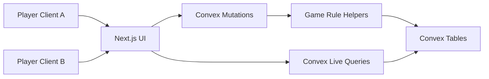

# Architecture

This project is a realtime, Pokemon-themed take on "25 Words or Less." The first version prioritizes a working multiplayer loop: guest players create and join lobbies, ready up, start a game, submit hints and guesses, and see scores update live.

## Stack

- Next.js App Router, React, and TypeScript for the web app.
- Tailwind CSS for styling and rapid iteration on the ZaneGames-inspired board.
- Convex for the authoritative realtime backend, database, mutations, and live queries.
- Vercel for the frontend deployment, with Convex deployed as part of the production build.
- Guest display names for the MVP, with player records structured so permanent auth can be added later.

## Runtime Model

Convex stores authoritative lobby, game, round, content, and event state. Clients subscribe to live queries and call mutations for all state changes. Pure TypeScript rule helpers live outside React so they can be tested directly and reused by Convex mutations.



## Core Tables

- `players`: guest identity, display name, optional future auth fields, and last seen time.
- `lobbies`: lobby code, visibility, status, host, game settings, and current game reference.
- `lobbyPlayers`: player membership, ready state, and join order.
- `games`: active game state, settings snapshot, round order, and scoreboard.
- `rounds`: hint giver, targets, hint words, submitted hints, current target index, and status.
- `guesses`: submitted guesses with scoring outcome.
- `content`: searchable Pokemon-related target words, categories, normalized labels, and image URLs.
- `events`: append-friendly audit trail for future stats, replays, and debugging.

## MVP Rules

- Classic mode starts with 10 target words and a 25-word scoring limit with a 40-word hard limit.
- The hint giver sees all target words; guessers only see solved targets and the active guessing flow.
- Targets must be solved in order.
- Correct guesses award the guesser 1 round point.
- A second or later guess on the same submitted hint costs that guesser 1 point.
- The hint giver score is calculated from remaining words when the round ends.
- Rerolls cost hint words using an increasing triangular cost: 1, then 2, then 3, and so on.
- Hint words are blocked when they match the full target label or any full token from a target label.

## Content Strategy

PokeAPI is treated as an import-time seed source instead of queried during active gameplay. This gives fast search, stable data, and room for curated entries. Classic mode starts with Pokemon, games, professors, items, gym leaders, and regions. Advanced mode adds types, badges, towns, moves, and abilities. Terminology is intentionally deferred as a future category.

Content rows are identified by category and normalized label together, so same-name entries can exist in different categories without overwriting each other. Imported rows keep source metadata (`source`, `sourceId`, and `sourceUrl`) so automated imports and curated entries can be audited later.

The first expansion pass uses PokeAPI for categories it models directly:

- `pokemon` from `pokemon-species`
- `item` from `item`
- `move` from `move`
- `ability` from `ability`
- `type` from `type`, excluding non-gameplay API types
- `region` from `region`
- `town` from `location`, with a later review pass because the API includes routes, caves, and facilities too
- `game` from `version`

Categories that PokeAPI does not model well should come from checked-in curated JSON or CSV files rather than runtime scraping. That includes gym leaders, badges, professors, terminology, and any human-readable aliases we want for game titles or locations.

The content import script fetches complete PokeAPI resource lists, maps them to `content` records, deduplicates by category and normalized label, writes to Convex in batches, and prints counts for accepted, skipped, duplicate, and image-less records. Round target selection reads all enabled category pools before sampling so expanded datasets are not limited to the first page or first 100 records.

## Deployment

Local development runs Next and Convex separately:

```sh
npm run dev
npm run dev:convex
```

Production should set `NEXT_PUBLIC_CONVEX_URL` and `CONVEX_DEPLOY_KEY` in Vercel, then use:

```sh
npx convex deploy --cmd 'npm run build'
```

## Deferred

- Permanent accounts, profile pictures, and stats dashboards.
- Full custom mode drafting and category toggles.
- Polished board animations and advanced visual effects.
- Fuzzy hint validation beyond normalized full-label and token checks.
- Playwright multiplayer browser automation.
